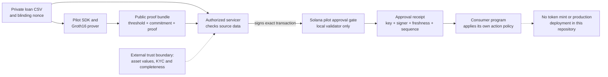

# Caledren: private-credit proof and approval tooling

> Prove coverage of a configured threshold over a private loan book, have the authorized servicer
> approve the exact claim, and record the result on Solana without publishing individual loans.

Working pilot alpha. `./pilot-demo.sh` reproduces the SDK, persisted parameters, private servicer
commitment check and stateful Solana approval gate. A finalized local approval used **85,529 CU**
in a **672-byte legacy transaction**, with separate payer and servicer signatures. The compiled
gate suite accepts two successive approvals and rejects 26 invalid requests without changing state.
Start with [PILOT_GUIDE.md](PILOT_GUIDE.md) and [PILOT_EVALUATION.md](PILOT_EVALUATION.md).

The gate pins an immutable verification key, servicer, minimum threshold and validity policy.
It enforces sequence and freshness and records the latest accepted commitment. It does not mint
tokens or derive a threshold from live supply. Single-party setup and external validation remain open.
The older `./demo.sh` reproduces the pairing-only benchmark and native proof/signature model; its **83,354 CU**
measurement is a different program. The EVM example is live on public Ethereum Sepolia.
**Solana devnet deployment is pending faucet funding.** See
[DEPLOYMENTS.md](DEPLOYMENTS.md) for network-specific evidence and reproduction commands.

## The problem

Tokenized private-credit systems depend on loan books and servicing data that live off-chain. A protocol
may need evidence that a supplied private book meets a coverage policy without publishing individual
loans. Smart-contract audits can inspect program logic, but they do not establish the truth or current
state of those off-chain assets.

## What it proves

A zero-knowledge proof attests, over a **private** loan book, that:

1. Performing collateral covers a public threshold selected by policy.
2. Every supplied KYC flag is true.
3. The private collateral and flags hash to the public blinded Poseidon commitment.

The two circuit public inputs are the threshold and commitment; the pilot bundle also identifies
loan count and the key. The on-chain approval requires the configured servicer's signer privilege
on the exact transaction. Its private commitment check binds collateral and flags to the book the
servicer reviewed. IDs and principal are outside that circuit commitment. Real asset values, KYC
decisions and the relationship between threshold and token supply require separate controls.

## Legacy verifier results (measured)

| Property | Result |
|---|---|
| Proof size | **128 bytes**, constant regardless of book size |
| Privacy | individual loans never revealed |
| On-chain verification | **83,354 CU** in both the SBF harness and a fresh local validator run (2026-09-17); earlier local-validator result: **83,352 CU**. About 6% of the 1.4M maximum, proof verification only. |
| On-chain cost vs book size | **constant** (a 10-loan and a 10,000-loan fund cost the same to verify) |
| Scale | 10,000 loans: **72.17s** proving plus **64.61s** setup; 1,000 loans: **3.82s** proving (2026-09-17 run) |
| Portability | verifies on Solana (`alt_bn128`) and any EVM chain (`ecPairing`) |
| Attack (swap book, reuse signature) | blocked |

## Related work

This repository does not claim to originate zero-knowledge solvency or compliance proofs. Broader
systems explore institutional privacy and multiple proof use cases; for example, the published
[Zyga construction](https://eprint.iacr.org/2025/1802) includes solvency attestation among its examples.
Caledren is narrower: an MIT-licensed reference implementation for one private-credit coverage
predicate, an authenticated local approval receipt and explicit consumer-side policy boundaries.

## Run it

```bash
./pilot-demo.sh  # current product workflow, local only
./demo.sh        # legacy cryptography and pairing benchmark
```

The setup compatibility rehearsal is pinned to Node 24 LTS and `iden3/snarkjs` 0.7.6:
`CEREMONY_NODE_BIN=/path/to/node24 ./ceremony-compat.sh`. It exports the existing arkworks
R1CS, verifies the phase-1/phase-2 transcript and proof conversions, and runs the result through
the compiled Solana gate. All rehearsal contributions are local; this is compatibility evidence,
not the externally contributed production ceremony funded in Milestone 2b.

The legacy demo runs statement soundness, realistic loan-tape decisions, the ZK proof, the
native proof/signature model plus the attack test, the 100/1,000-loan benchmark, and (if the Solana toolchain is installed) the real
on-chain compute-unit measurement. Needs Rust; stage 6 needs the Solana toolchain. Run
`cargo run --release --bin audit` for the separate adversarial audit and
`cargo run --release --bin bench -- 10000` for the larger benchmark. Public deployment receipts
are checked separately; `./demo.sh` does not redeploy to either public network.

## Architecture and trust boundaries



The circuit proves a predicate over supplied witnesses. The servicer remains responsible for source
data, the gate authenticates a configured signer and policy, and a consumer must independently decide
what an unexpired receipt authorizes. See [docs/ARCHITECTURE.md](docs/ARCHITECTURE.md) for the component,
data and trust boundaries.

## How it works

- **The statement** (`src/circuit.rs`): an R1CS circuit: sum of performing collateral `>=` threshold,
  every KYC flag true, and the book's Poseidon commitment equals a public input. Groth16 over BN254.
- **The binding models** (`commit_book` + `src/onchain_bytes.rs`): the legacy native model signs the
  Poseidon commitment and checks the proof against that same value. In the pilot workflow, the
  servicer privately recomputes the commitment before co-signing the exact approval transaction.
  Neither model independently establishes that the source data is true.
- **The pilot SDK and gate** (`src/pilot.rs`, `gate-protocol/`, `solana-gate/`): reuse parameters,
  validate CSV and wire inputs, privately check the book commitment, enforce the stored key and
  signer policy, and write a fresh sequential approval receipt. Consumers must pin the approved
  configuration address as well as the program and independently enforce their action policy.
- **The legacy verifier** (`solana-verifier/`): verifies a Groth16 pairing equation via Solana's
  `alt_bn128` syscalls. It accepts a caller-supplied verifying key and does not check the servicer
  signature or invoke a token mint. `src/onchain.rs` models the combined gate natively with
  ed25519-dalek. Production integration needs an approved circuit/key, authenticated signature
  binding, threshold/freshness policy and token authorization. BN254 also permits EVM verification
  through `ecPairing`; the Sepolia example contains its own baked-in proof.

## Repo layout

```
src/lib.rs            servicer-signed loan tape + native predicate (evaluate)
src/circuit.rs        the ZK statement (Groth16 R1CS) + prove_solvency + Poseidon commitment
src/onchain_bytes.rs  serialize proof/vk/public inputs into the on-chain byte layout
src/prove.rs          ZK proof + soundness checks            (bin: prove)
src/onchain.rs        native proof/signature model + attack    (bin: onchain)
src/pipeline.rs       CSV loan tape -> native model decision   (bin: pipeline)
src/bench.rs          prover cost vs book size                (bin: bench)
src/pilot.rs          reusable parameters, strict CSV ingestion, proof and private attestation API
src/pilot_cli.rs      setup / prove / check-attestation       (bin: pilot)
gate-protocol/       strict versioned instruction and account encodings
solana-gate/         immutable policy, servicer signer, freshness, sequence and approval receipt
pilot-demo.sh        current product workflow and real local RPC transaction
solana-verifier/      on-chain Groth16 verifier program (SBF) + compute-unit test
client/               RPC client: sends a real proof tx to a deployed program
examples/             realistic loan-tape CSVs (solvent, insolvent)
DESIGN_PARTNER_BRIEF.md  design-partner one-pager
docs/ARCHITECTURE.md     component, data-flow and trust-boundary reference
CONTRIBUTING.md          local development and evidence-submission guidance
```

## What is proven, and what is not

**Reproduced:** honest solvent books satisfy the circuit; insolvent, KYC-failed and wrong-commitment
books fail the audit checks. Honest proofs verify, while a flipped proof bit or changed public input
is rejected. The native signature-binding model rejects a swapped book. These checks do not establish
soundness against an adversary controlling setup parameters or the verifying key.

**Limits:** a proof certifies a predicate over supplied data, not whether the off-chain data is true.
The circuit enforces KYC flags, not an independent real-world KYC assessment. The current setup uses
secure randomness, but is single-party. The blinded commitment and circuit-based BLOCKED path are
implemented; older descriptions saying otherwise were stale. The compatibility rehearsal is not a
complete ceremony. The legacy pairing program still accepts a caller-supplied key. The pilot
gate adds stored-key, signer and policy enforcement, but neither program mints tokens. See [KNOWN_LIMITATIONS.md](KNOWN_LIMITATIONS.md) and
[AUDIT.md](AUDIT.md). This is not a production or third-party-security-audited system.

*Performance figures are dated observations from Apple M4 hardware and the Solana SBF runtime, not
performance guarantees.*

## Website and deployments

The public site is https://caledren.com (also https://www.caledren.com), hosted by the existing
Vercel project `satyawansinghs-projects/rwa-credit-proof`. This repository is linked directly to that
project. Deployments are manual from the repository root; GitHub auto-deploy is not configured.
A push does not publish a reviewed release automatically.

```bash
cd ~/rwa-credit-proof
# Once per fresh checkout, using the already authenticated Vercel CLI:
vercel link --yes --scope satyawansinghs-projects --project rwa-credit-proof
# Build and inspect locally:
npm run build
python3 -m http.server 8765 --bind 127.0.0.1 --directory dist
# Create a preview from this checkout:
vercel deploy --scope satyawansinghs-projects
# Only after checking the preview and receiving explicit production approval:
vercel promote <reviewed-preview-url> --scope satyawansinghs-projects
```

The website source lives in `site/`; `scripts/build-site.mjs` generates `dist/` using the dated
core receipt/log bundle and the latest separately dated devnet-status record linked by
`DEPLOYMENTS.md`. It checks those facts against the deployment and
limitation records and stops if they disagree. `EVIDENCE.html` remains the separate printable
technical sheet and is copied into the built site unchanged. Only the generated `dist/` is served;
the deployment upload is restricted by `.vercelignore` to website source and public evidence inputs.
`.vercel/`, local environment files and generated output are ignored by Git.

The animated proof sphere uses local Canvas and CSS, with no external rendering dependencies.
It illustrates the private-input/public-proof flow; it does not represent live network activity.
Motion can be paused, respects the operating system's reduced-motion setting, and stops rendering
the sphere when the hero is off screen or the tab is hidden. Core content remains available without
JavaScript. Run `npm run check` after building to validate links, source evidence and public output.

The other sections use SVG/CSS motion: evidence traces, a Commit/Prove/Verify path, an illustrated
native gate that responds to the chosen scenario, audit graphics, execution-scope boundaries and
a design-partner invitation. Recorded measurements stay fixed. Each section pauses its decorative
animations off screen, and the global motion control applies to the whole page. The sticky navigation
includes an Explore menu on smaller screens.

Do not deploy from a scratch copy, connect other Vercel projects, or promote production or push to
GitHub without explicit approval. To update a network claim, update `DEPLOYMENTS.md` and its
receipt/status evidence together, then rebuild and check a new preview.
