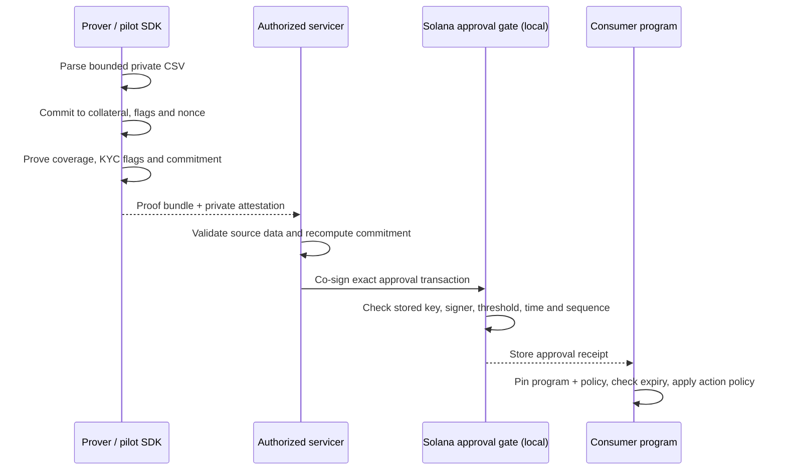

# Architecture and trust boundaries

Caledren is a local pilot alpha composed of a private-data SDK, a Groth16 circuit and a stateful
Solana approval gate. It produces an approval receipt; it does not mint a token, deploy a fund or
establish that off-chain records are true.

## Current pilot flow

All Solana evidence for this flow is from a local validator. No devnet or production deployment of
the pilot gate is claimed.

## Component boundaries

| Component | Establishes | Does not establish |
|---|---|---|
| Pilot SDK | Strict CSV parsing, reusable parameters, proof generation and private commitment checking | Truth, completeness or valuation of source records |
| Groth16 circuit | Performing collateral covers a public threshold; supplied KYC flags are true; witnesses match the public commitment | Real-world KYC, undisclosed liabilities, token supply or trusted setup provenance |
| Authorized servicer | Solana signer authorization over the exact approval transaction | Independence or correctness of the servicer's real-world processes |
| Pilot gate | Stored-key proof verification plus signer, threshold, freshness and sequence policy | Token minting, one-time downstream consumption or consumer authorization |
| Consumer | Interprets an unexpired receipt under its own pinned policy and action rules | Any guarantee beyond the checks it explicitly implements |

## Public and private data

The public proof bundle contains the threshold, blinded commitment, proof, loan count and approved-key
hash. The loan CSV, loan identifiers, principal amounts and commitment nonce remain private. The
approval transaction carries the proof and public claim, not the loan tape or nonce.

The circuit commitment covers ordered collateral values, performance/KYC flags and the nonce. It does
not cover loan IDs or principal. The SDK's source digest is a private workflow consistency check, not
an on-chain commitment.

## Setup boundary

The current parameters are generated by one operator with secure randomness. The compatibility
rehearsal checks the pinned phase-1/phase-2 tooling and exact circuit, but its contributors are also
controlled by one operator. A public, independently contributed ceremony with reviewed provenance is
future grant work, not a present capability.

## Network boundary

- The pilot approval gate has only local-validator evidence.
- The legacy Solana verifier is a separate pairing-only example and accepts a caller-supplied key.
- The Sepolia contract is a separate public example with a baked-in proof and key.
- None of these components mints SPL tokens or deploys a production financial product.

See [DEPLOYMENTS.md](../DEPLOYMENTS.md), [PILOT_GUIDE.md](../PILOT_GUIDE.md) and
[KNOWN_LIMITATIONS.md](../KNOWN_LIMITATIONS.md) for evidence, integration details and open risks.
